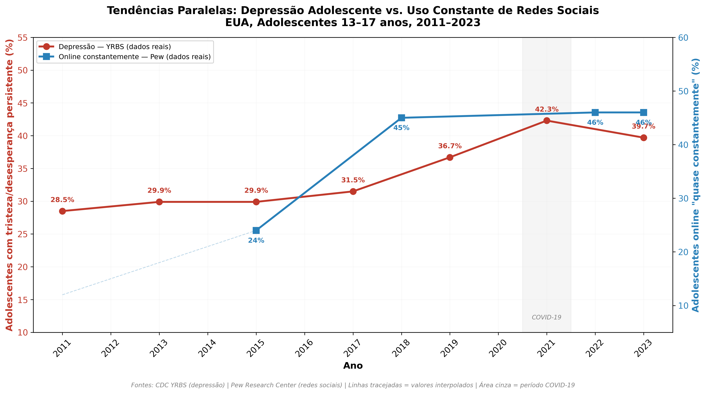
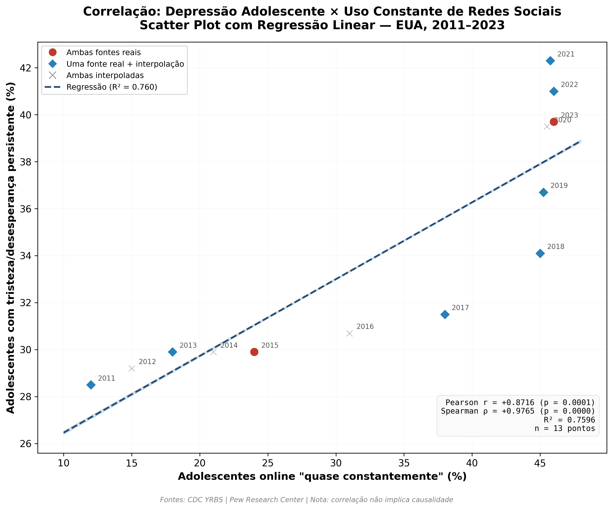
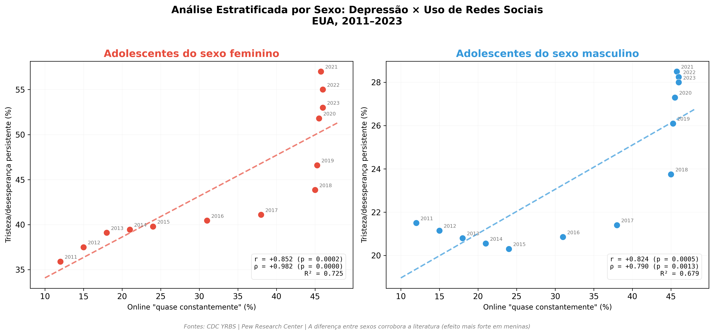
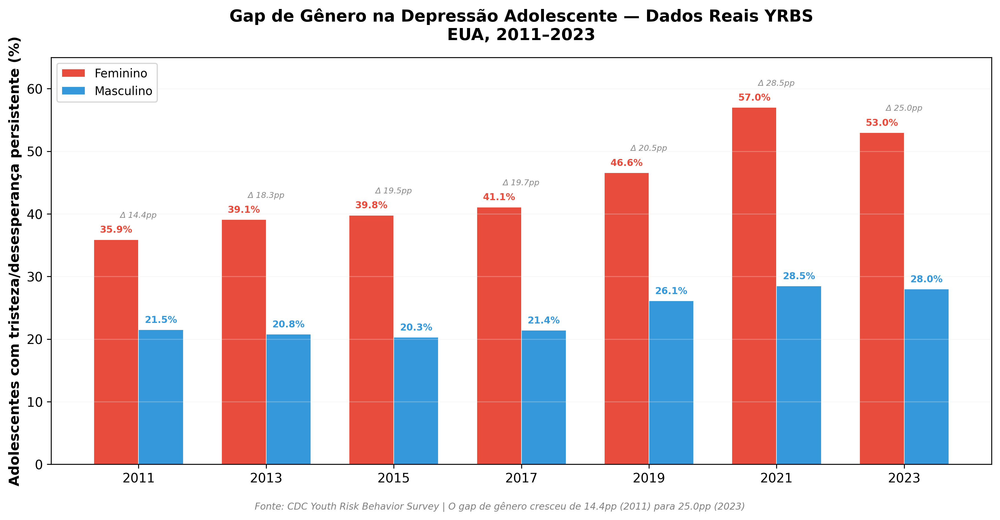

# Correlação entre Depressão Adolescente e Uso de Redes Sociais nos EUA (2011–2023)

> **MVP — Trabalho de Conclusão de Curso**
> Análise descritivo-correlacional utilizando dados do CDC YRBS e Pew Research Center
>
> https://colab.research.google.com/drive/1cZfDDBzY1Nq2AvGJT9Wsh-RhQdccMIhC#scrollTo=6gGNHMxSIbdY

---

## Problema de pesquisa

*"Existe correlação estatisticamente significativa entre o aumento do uso de redes sociais e o aumento na prevalência de sintomas depressivos entre adolescentes norte-americanos (13–17 anos) no período de 2011 a 2023?"*

## Principais resultados

| Métrica | Valor | Significância |
|---------|-------|---------------|
| Pearson r | +0.87 | p = 0.0001 |
| Spearman ρ | +0.98 | p < 0.000001 |
| R² | 0.76 | 76% da variância explicada |
| Robustez (sem 2021/COVID) | r = +0.88 | p = 0.0002 |

### Gráficos gerados

<p align="center">
  
  
</p>
<p align="center">
  
  
</p>

## Estrutura do repositório

```
mvp-depressao-redes-sociais/
│
├── README.md                          ← Este arquivo
├── requirements.txt                   ← Dependências Python
│
├── notebooks/
│   └── TCC_Depressao_RedesSociais.ipynb   ← Notebook principal (Colab-ready)
│
├── scripts/
│   ├── analise_depressao_redes_sociais.py  ← Análise de séries temporais (standalone)
│   └── analise_complementar_yrbs2023.py   ← Análise intra-survey YRBS 2023
│
├── data/
│   └── tabela_mestre_dados.csv            ← Dados consolidados (YRBS + Pew)
│
├── outputs/
│   ├── grafico1_tendencias_temporais.png
│   ├── grafico2_scatter_correlacao.png
│   ├── grafico3_estratificacao_sexo.png
│   ├── grafico4_gap_genero.png
│   ├── grafico5_intrasurvey_depressao_sm.png
│   └── grafico6_heatmap_sexo_sm.png
│
└── docs/
    ├── plano_pesquisa_estrategia_a.docx   ← Plano de pesquisa completo
    └── capitulo1_introducao.docx          ← Capítulo 1 — Introdução
```

## Fontes de dados

| Fonte | Variável | Cobertura | Acesso |
|-------|----------|-----------|--------|
| **CDC YRBS** | % com tristeza/desesperança persistente (Q26) | 2011–2023, bienal | [cdc.gov/yrbs](https://www.cdc.gov/yrbs/data/index.html) |
| **Pew Research** | % online "quase constantemente" | 2015–2024 | [pewresearch.org](https://www.pewresearch.org/internet/fact-sheet/teens-and-social-media-fact-sheet/) |
| **CDC YRBS 2023** | Microdados individuais (N=20.103) | 2023 | [cdc.gov/yrbs/data](https://www.cdc.gov/yrbs/data/national-yrbs-datasets-documentation.html) |

**Nota sobre coleta:** Os dados agregados do YRBS e do Pew Research foram extraídos manualmente dos relatórios oficiais publicados por cada instituição (não há API pública para esses surveys de adolescentes). As referências completas estão documentadas no plano de pesquisa e no notebook. Os dados brutos estão versionados em `data/tabela_mestre_dados.csv`.

## Como executar

### Opção 1 — Google Colab (recomendado)

1. Abra `notebooks/TCC_Depressao_RedesSociais.ipynb` no Google Colab
2. Execute **Runtime → Run all** (Ctrl+F9)
3. Todas as dependências já estão pré-instaladas no Colab

### Opção 2 — Local

```bash
# Clonar o repositório
git clone https://github.com/[seu-usuario]/mvp-depressao-redes-sociais.git
cd mvp-depressao-redes-sociais

# Instalar dependências
pip install -r requirements.txt

# Executar análise principal
python scripts/analise_depressao_redes_sociais.py

# Executar análise complementar (YRBS 2023)
python scripts/analise_complementar_yrbs2023.py
```

## Metodologia

O projeto utiliza duas estratégias complementares:

**Parte A — Séries temporais (2011–2023):** Correlação entre dados agregados de depressão (YRBS) e uso de redes sociais (Pew Research), com interpolação linear para alinhamento temporal. Testes de Pearson e Spearman, estratificação por sexo, e teste de robustez excluindo 2021 (efeito COVID-19).

**Parte B — Intra-survey (YRBS 2023):** Análise de dados individuais do YRBS 2023, que pela primeira vez incluiu pergunta sobre frequência de uso de redes sociais. Tabelas cruzadas, qui-quadrado, razão de prevalência e odds ratio. Esta análise mitiga a falácia ecológica da Parte A.

## Limitações (documentadas)

- Correlação não implica causalidade
- Falácia ecológica na Parte A (dados agregados)
- Valores interpolados introduzem premissa de linearidade
- 2021 pode ser confundido pelo efeito COVID-19
- Dados auto-reportados (não diagnóstico clínico)
- Sem controle de variáveis confundidoras (decisão de escopo)

## Dependências

- Python 3.8+
- pandas, numpy, scipy, matplotlib, seaborn

## Referências principais

1. CDC. *Youth Risk Behavior Survey Data Summary & Trends Report: 2013–2023.* 2024.
2. Pew Research Center. *Teens, Social Media and Technology 2024.* 2024.
3. U.S. Surgeon General. *Social Media and Youth Mental Health Advisory.* 2023.
4. Liu, M. et al. *Time Spent on Social Media and Risk of Depression in Adolescents: A Dose-Response Meta-Analysis.* IJERPH, 2022.
5. Kreski, N. et al. *Social Media Use and Depressive Symptoms Among US Adolescents.* J Adolesc Health, 2021.

## Licença

Este projeto é de uso acadêmico. Os dados utilizados são de domínio público (CDC) e acesso aberto (Pew Research).
